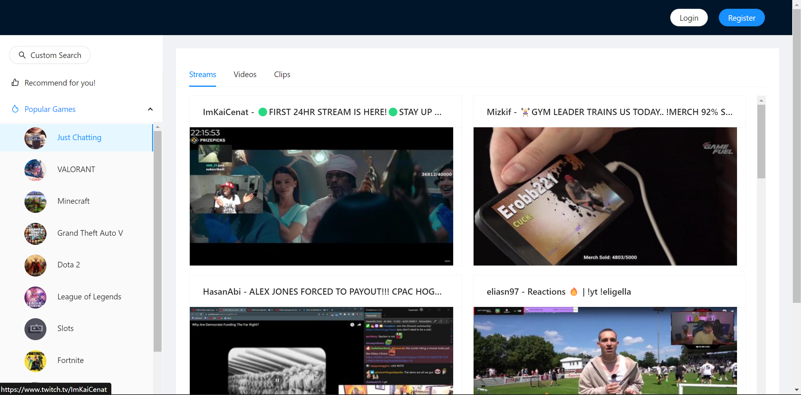
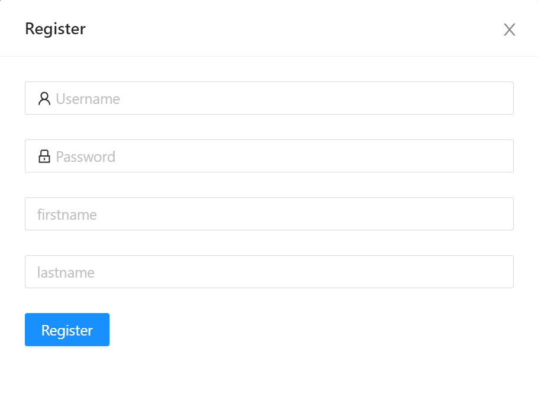
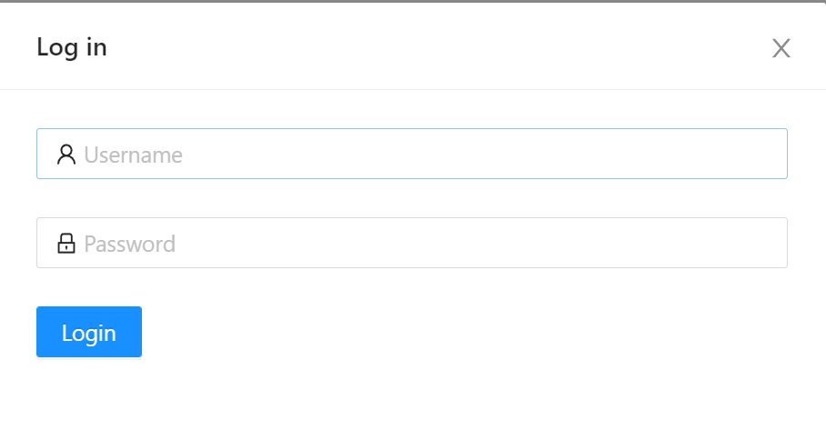
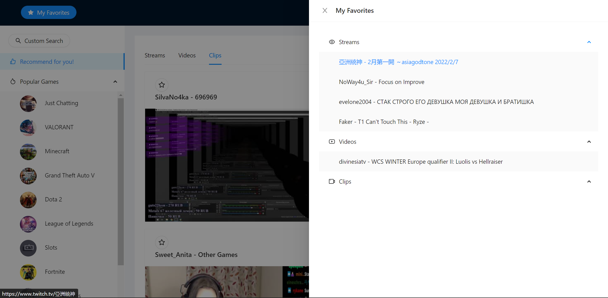
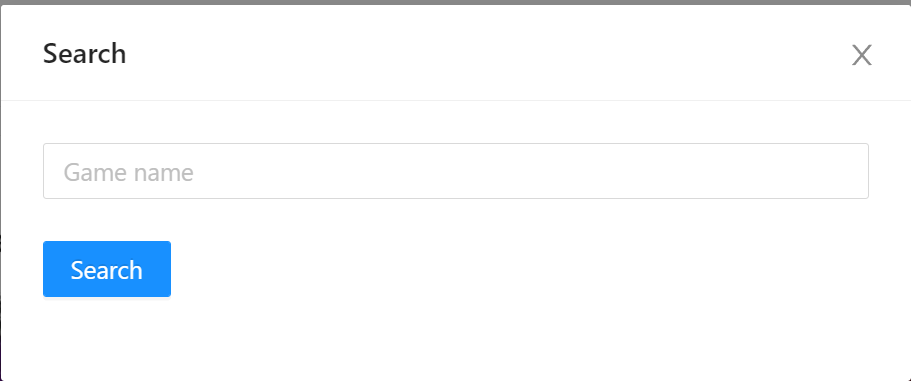

## Introduction

This repo is the front-end of [Twitch+](https://github.com/peteryoungy/chaoyuemm).

## How to Use

1. Run back-end service first. You can find the back-end code [here](https://github.com/peteryoungy/chaoyuemm).

2. Start the front end.

```bash
# Clone this repository
$ git clone git@github.com:peteryoungy/jupiter-web.git

# Enter this directory
$ cd jupiter-web

# Install packages
$ npm install

# Start the app
$ npm start
```

## Pages & Features

- **Home Page**  

<p align='left'>
      
</p>

- **Sign Up and Log In**

<p align='left'>
    
&nbsp; &nbsp;
    
</p>

- **Favorites**

<p align='left'>
      
</p>

- **Search**

<p align='left'>
      
</p>

